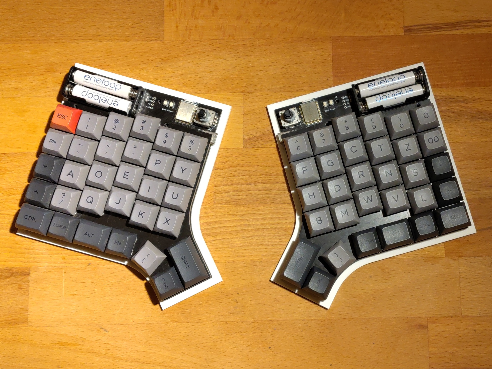

# Blackwing keyboard

The Blackwing keyboard is a vertically staggered split keyboard inspired by the [Mitosis keyboard](https://github.com/reversebias/mitosis).

## Features

- QMK firmware
- Cherry MX switches
- nRF52840 module
- NKRO as each switch is wired to its own GPIO
- Nordic's proprietary low power radio protocol
- Uses the receiver from the [Mitosis keyboard](https://github.com/reversebias/mitosis)
- Runs months to years on battery as it stays in deep sleep until a button is pressed or released
- PCB plate for plate mounted switches

## Todo

- Merge firmware into QMK project
- Use nRF 52840 dongle as receiver
- Build a ZMK based firmware
- Add Bluetooth support
